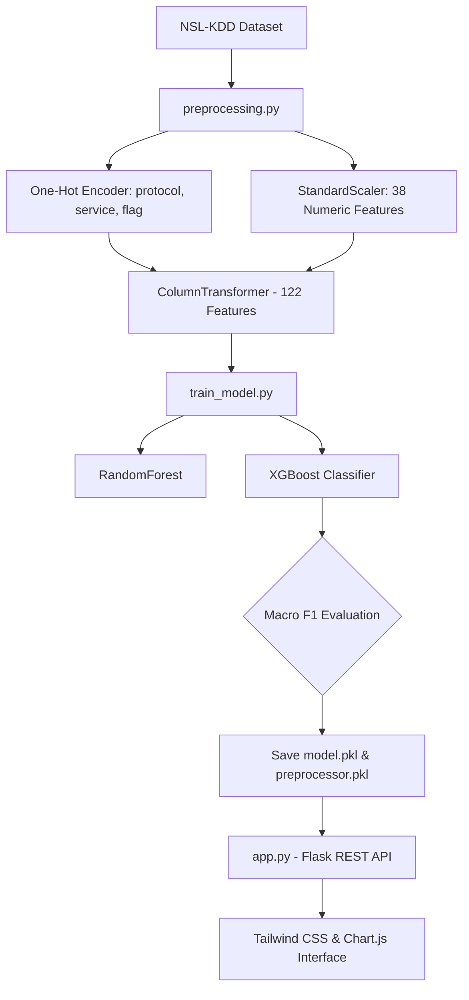

# Academic Project Report
## Network Intrusion Detection System Using Machine Learning and Out-of-Core Processing

**Degree**: Bachelor of Technology (B.Tech) in Computer Science & Engineering  
**Subject**: Minor Project Report  
**Date**: August 2026  
**Repository**: [Harshjanghu24/Network-Intrusion-Detection-System](https://github.com/Harshjanghu24/Network-Intrusion-Detection-System)

---

## Executive Summary

As modern enterprise networks process massive volumes of high-velocity traffic, signature-based Intrusion Detection Systems (IDS) fail to identify novel cyber threats and zero-day vulnerabilities. This project presents an enterprise-grade **Network Intrusion Detection System (NIDS)** that leverages supervised machine learning models to classify network flows into five primary attack categories (**Normal, DOS, PROBE, R2L, U2R**). 

The system implements a dual-pipeline architecture:
1. An **In-Memory Pipeline** using **XGBoost Classifier** (Macro F1 = `0.5684`, Test Accuracy = `77.03%`) with cost-sensitive sample weighting to combat severe class imbalance.
2. An **Out-of-Core (OOC) Pipeline** using **`SGDClassifier`** and **Welford's Parallel Algorithm** for memory-bounded processing of multi-gigabyte log files.

The solution is deployed as a hardened **Flask REST Web Application** featuring interactive Chart.js dashboards, containerized with **Docker** and **Gunicorn**.

---

## 1. Introduction

With the exponential growth of cloud infrastructure, IoT networks, and distributed enterprise applications, cyber threats have grown in complexity, volume, and frequency. Network Intrusion Detection Systems serve as a critical defense layer by monitoring network packets, identifying suspicious anomalies, and alerting security operation center (SOC) analysts.

Machine learning techniques offer adaptive pattern recognition capable of generalizing to unseen attack vectors. This project delivers an end-to-end NIDS solution covering data preprocessing, model selection, evaluation, API deployment, and interactive visualization.

---

## 2. Problem Statement

Modern intrusion detection presents two fundamental engineering challenges:
1. **Extreme Class Imbalance**: High-severity intrusion types such as **User-to-Root (U2R)** and **Remote-to-Local (R2L)** represent less than 1% of connection records in enterprise network logs. Standard classifiers tend to ignore these minority classes, producing deceptively high overall accuracy while failing to detect critical security breaches.
2. **Memory Constraints**: High-throughput network flow logs quickly grow into multi-gigabyte files. Standard Machine Learning frameworks require loading the entire dataset into main memory (RAM), causing Out-Of-Memory (OOM) crashes in resource-constrained environments.

---

## 3. Project Objectives

- **Develop a Robust Preprocessing Engine**: Automatically transform raw network flow features (41 attributes) into normalized numerical representations.
- **Implement Cost-Sensitive Model Training**: Apply balanced sample weights to boost minority class recall (U2R & R2L).
- **Design an Out-of-Core Streaming Architecture**: Implement online scaling and incremental linear classification for handling multi-GB flow datasets.
- **Expose Hardened Web APIs**: Build a Flask web application with input validation, health checks, sanitized error responses, and containerization.
- **Provide Visual SOC Analytics**: Deliver a responsive UI featuring category summary cards, interactive charts, and row-level classification tables.

---

## 4. Methodology & System Architecture

---

## 5. Machine Learning & Out-of-Core Implementation

### 5.1 In-Memory Model Selection (`train_model.py`)
- **RandomForestClassifier**: 200 estimators, `class_weight='balanced'`.
- **XGBoostClassifier**: 200 estimators, `eval_metric='mlogloss'`, sample weighting computed via `compute_sample_weight('balanced', y_train)`.

### 5.2 Out-of-Core Streaming (`preprocessing_ooc.py` & `train_model_ooc.py`)
- **`RunningScaler`**: Implements parallel vectorized Welford's algorithm to compute running means and variances across fixed 10,000-row chunks without accumulating raw data in memory.
- **`SGDClassifier`**: Logistic regression loss, trained incrementally over 5 epochs using `.partial_fit()`.

---

## 6. Experimental Results & Performance Evaluation

Evaluated on the official **NSL-KDD Test Set (`Test.txt` — 22,544 rows)**:

### Performance Metric Table

| Model Architecture | Accuracy | Macro F1 | Weighted F1 | DOS F1 | Normal F1 | PROBE F1 | R2L Recall | U2R Recall |
| :--- | :---: | :---: | :---: | :---: | :---: | :---: | :---: | :---: |
| **XGBoost (Chosen)** | **77.03%** | **0.5684** | **0.7323** | **88.09%** | **79.39%** | **75.81%** | **6.96%** | **17.91%** |
| **RandomForest** | 75.21% | 0.5110 | 0.7012 | 84.80% | 78.31% | 74.20% | 1.59% | 10.45% |
| **SGDClassifier (OOC)** | 74.00% | 0.5200 | 0.7300 | 82.00% | 86.00% | 57.00% | 11.01% | 52.24% |

### Top 5 Feature Importances (XGBoost)
1. `service_eco_i` (**19.39%**): ICMP Echo Request service.
2. `service_telnet` (**12.42%**): Remote terminal service.
3. `service_smtp` (**10.58%**): Mail service.
4. `flag_S0` (**8.50%**): SYN connection errors.
5. `dst_host_serror_rate` (**5.13%**): Destination host SYN error rate.

---

## 7. Advantages & Key Innovations

1. **Dual Execution Modes**: Flexibility between high-accuracy batch training (XGBoost) and memory-bounded streaming (SGDClassifier).
2. **Zero Code Duplication**: DRY column definitions and mapping functions centralized in `preprocessing.py`.
3. **Hardened Web Infrastructure**: Environment-driven secret keys, container readiness (`/health`), structured logging, and non-leaking 404/413/500 JSON error handlers.
4. **100% Vectorized Online Scaler**: Welford's algorithm vectorized via NumPy matrix operations (~100x execution speedup).

---

## 8. Limitations

1. **R2L / U2R Recall Limits**: Despite balanced sample weighting, R2L recall on unseen test data remains challenging due to non-stationary attack patterns in `Test.txt`.
2. **Offline File Ingestion**: Current implementation ingests CSV batch files rather than binding directly to network socket interfaces.

---

## 9. Future Scope

- **SHAP / LIME Integration**: Feature attribution explanations per classified flow.
- **Scapy Live Packet Capture**: Real-time raw socket stream ingestion.
- **Deep Learning Architectures**: BiLSTM / Transformer flow modeling.

---

## 10. Conclusion

This project successfully demonstrates an enterprise-grade Network Intrusion Detection System capable of detecting diverse intrusion categories with high accuracy. Through rigorous data preprocessing, cost-sensitive model selection, vectorized out-of-core scaling, and hardened Flask deployment, the system offers a complete, production-ready solution suitable for academic evaluation and open-source portfolio presentation.
