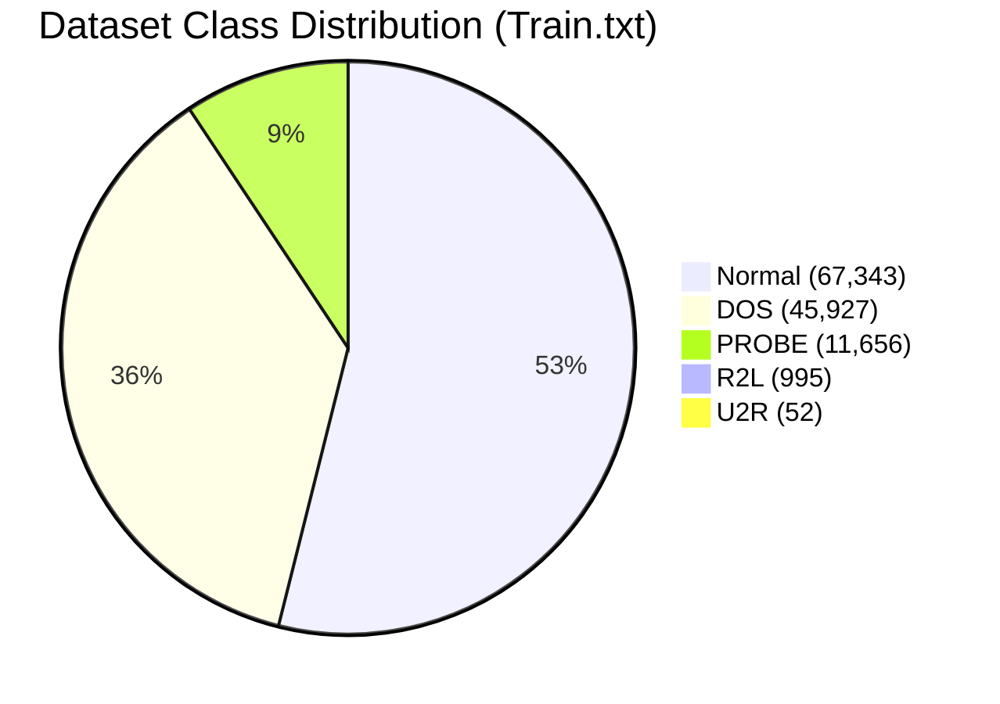
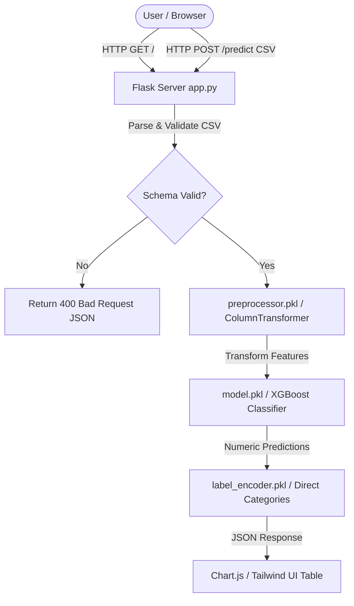
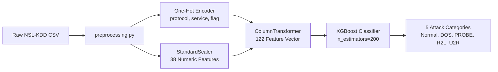

# Network Intrusion Detection System (NIDS)


An enterprise-grade, machine-learning-powered **Network Intrusion Detection System (NIDS)** that analyzes network connection records, detects malformed or malicious packet signatures, and categorizes cyber threats into five major intrusion categories (**Normal, DOS, PROBE, R2L, U2R**). Built using **Flask**, **scikit-learn**, **XGBoost**, and **Tailwind CSS**, with support for both in-memory batch processing and memory-efficient **Out-of-Core (OOC)** streaming.

---

## 📋 Table of Contents

- [Project Overview](#-project-overview)
- [Problem Statement](#-problem-statement)
- [Objectives](#-objectives)
- [Key Features](#-key-features)
- [Tech Stack](#-tech-stack)
- [Dataset Architecture (NSL-KDD)](#-dataset-architecture-nsl-kdd)
- [Folder Structure](#-folder-structure)
- [System Architecture](#-system-architecture)
- [Machine Learning Pipeline](#-machine-learning-pipeline)
- [Flask Application Flow](#-flask-application-flow)
- [Installation Guide](#-installation-guide)
- [Running Locally](#-running-locally)
- [Docker Deployment](#-docker-deployment)
- [Usage Guide & CSV Schema](#-usage-guide--csv-schema)
- [API Reference](#-api-reference)
- [Model Details & Performance](#-model-details--performance)
- [Screenshots & Visuals](#-screenshots--visuals)
- [Documentation Directory](#-documentation-directory)
- [Future Improvements](#-future-improvements)
- [License](#-license)
- [Author & Team](#-author--team)

---

## 📌 Project Overview

Network Intrusion Detection Systems (NIDS) serve as the front line of cyber defense, inspecting network traffic to identify unauthorized access, Denial of Service (DoS) attacks, scanning probes, and privilege escalation attempts. 

This project delivers a complete, end-to-end Machine Learning web application capable of:
1. Parsing raw network session records (41 flow features).
2. Transforming categorical protocols, services, and flags via One-Hot Encoding and Standard Scaling.
3. Classifying sessions into attack categories using an optimized **XGBoost Classifier** (In-Memory) or **SGDClassifier + Welford's Scaler** (Out-of-Core).
4. Presenting interactive dashboard visual analytics, category summaries, and row-level breakdown tables via a modern web interface.

---

## 🎯 Problem Statement

Traditional signature-based Intrusion Detection Systems (like Snort) fail to detect novel attack variants (Zero-Day exploits) and struggle with high-throughput flow logs. Machine Learning models offer adaptive pattern recognition, but face two major operational challenges:
1. **Severe Class Imbalance**: Rare, high-severity attacks such as **User-to-Root (U2R)** (0.04% of training traffic) and **Remote-to-Local (R2L)** (0.78%) are frequently missed by naive classifiers.
2. **Memory Constraints**: High-velocity network environments yield multi-gigabyte log files that exceed RAM limits during standard batch preprocessing and training.

This project addresses both challenges by combining **cost-sensitive learning** (`class_weight='balanced'`) with an **Out-of-Core streaming architecture**.

---

## 🚀 Key Features

- **Dual Machine Learning Pipelines**:
  - **In-Memory Pipeline**: Evaluates RandomForest vs. XGBoost, selecting the optimal model based on Macro F1 score.
  - **Out-of-Core Pipeline**: Online streaming using `SGDClassifier` and Welford's algorithm for memory-bounded multi-GB execution.
- **Robust Feature Engineering**: Pipeline transformations for 38 numerical features and 3 categorical variables (`protocol_type`, `service`, `flag`).
- **Hardened Flask REST API**: Features `/health` endpoints, custom 404/413/500 JSON error handlers, structured logging, and non-leaking exception responses.
- **Interactive UI**: Styled with Tailwind CSS, supporting drag-and-drop CSV uploads, dynamic Chart.js visualizations, and client-side table search/export.
- **Production Containerization**: Fully Dockerized using `python:3.12-slim` and **Gunicorn** WSGI application server.

---

## 🛠️ Tech Stack

- **Core Language**: Python 3.12
- **Web Framework**: Flask 3.1.0, Werkzeug, Gunicorn
- **Machine Learning**: scikit-learn 1.9.0, XGBoost 3.3.0, Joblib
- **Data Engineering**: Pandas 2.2+, NumPy 2.0+
- **Frontend**: HTML5, Vanilla JavaScript, Tailwind CSS, Chart.js
- **Containerization**: Docker

---

## 📊 Dataset Architecture (NSL-KDD)

The system is trained and evaluated on the **NSL-KDD** benchmark dataset, an refined version of the KDD Cup 99 dataset that eliminates duplicate records and redundant noise.

| Metric | Training Set (`Train.txt`) | Test Set (`Test.txt`) | Combined Total |
| :--- | :---: | :---: | :---: |
| **Total Connections** | 125,973 | 22,544 | 148,517 |
| **Feature Columns** | 41 | 41 | 41 |
| **Target Columns** | `attack_type`, `difficulty_level` | `attack_type`, `difficulty_level` | — |

### Attack Category Mapping (40 Attack Types $\rightarrow$ 5 Classes)



- **Normal**: Standard benign network traffic.
- **DOS (Denial of Service)**: e.g., `neptune`, `smurf`, `back`, `teardrop`, `pod`, `land`, `apache2`.
- **PROBE (Surveillance / Scanning)**: e.g., `satan`, `ipsweep`, `nmap`, `portsweep`, `mscan`, `saint`.
- **R2L (Remote to Local Access)**: e.g., `guess_passwd`, `warezmaster`, `ftp_write`, `multihop`, `imap`.
- **U2R (User to Root Escalation)**: e.g., `buffer_overflow`, `loadmodule`, `rootkit`, `perl`, `sqlattack`.

---

## 📁 Folder Structure

```
Network-Intrusion-Detection-System/
├── app.py                      # Main Flask application & REST API routes
├── eda.py                      # Exploratory Data Analysis & visual plotting
├── preprocessing.py            # Centralized in-memory preprocessing pipeline
├── preprocessing_ooc.py        # Out-of-core online preprocessing & RunningScaler
├── train_model.py              # In-memory model training (RandomForest vs XGBoost)
├── train_model_ooc.py          # Out-of-core online training (SGDClassifier)
├── sample_upload.csv           # Validated sample CSV for testing predictions
├── requirements.txt            # Production dependencies (Flask, sklearn, xgboost, gunicorn)
├── requirements-dev.txt        # Development dependencies (matplotlib, seaborn)
├── requirements_ooc.txt        # Out-of-core specific dependencies
├── Dockerfile                  # Production container build recipe
├── .dockerignore               # Docker build exclusions
├── .gitignore                  # Git version control exclusions
├── LICENSE                     # MIT License
├── README.md                   # Project documentation
├── docs/                       # Detailed technical documentation directory
│   ├── API.md                  # REST API reference
│   ├── Architecture.md         # Deep architectural design
│   ├── Dataset.md              # Feature definitions & class distributions
│   ├── Deployment.md           # Docker & Gunicorn deployment guide
│   ├── FutureWork.md           # Project roadmap
│   ├── Installation.md         # Environment setup guide
│   ├── Model.md                # ML evaluation & feature importance
│   └── Troubleshooting.md      # FAQ & error resolution
├── results/                    # Saved evaluation artifacts & metrics
│   ├── class_distribution.png  # Training class distribution plot
│   ├── evaluation_report.json  # In-memory model test metrics
│   ├── feature_importance.json # Top feature importances
│   └── ooc_evaluation_report.json # Out-of-core test metrics
├── templates/
│   └── index.html              # Frontend upload dashboard
└── static/
    └── style.css               # Custom CSS overrides
```

---

## 🏗️ System Architecture



---

## ⚙️ Machine Learning Pipeline



---

## 💻 Installation Guide

### Prerequisites
- **Python**: Version 3.12 (or 3.10+)
- **Git**: Installed on your operating system
- **Virtualenv**: Recommended

### Steps

1. **Clone the Repository**:
   ```bash
   git clone https://github.com/Harshjanghu24/Network-Intrusion-Detection-System.git
   cd Network-Intrusion-Detection-System
   ```

2. **Create and Activate Virtual Environment**:
   - **Windows (PowerShell)**:
     ```powershell
     python -m venv venv
     .\venv\Scripts\Activate.ps1
     ```
   - **Linux / macOS**:
     ```bash
     python3 -m venv venv
     source venv/bin/activate
     ```

3. **Install Dependencies**:
   ```bash
   pip install --upgrade pip
   pip install -r requirements.txt
   ```

---

## 🏃 Running Locally

### 1. Launch the Flask Web Application
```bash
python app.py
```
Open your browser and navigate to: `http://127.0.0.1:5000/`

### 2. Train the Models (Optional)
To retrain the in-memory models (RandomForest vs XGBoost) on `NSL_Dataset/Train.txt`:
```bash
python train_model.py
```
To run the Out-of-Core streaming trainer:
```bash
python train_model_ooc.py
```

---

## 🐳 Docker Deployment

### 1. Build the Docker Image
```bash
docker build -t nids-app .
```

### 2. Run the Container
```bash
docker run -d -p 5000:5000 --name nids-container nids-app
```
Access the application at: `http://localhost:5000/`

---

## 📋 Usage Guide & CSV Schema

Uploaded CSV files must contain the standard **41 NSL-KDD feature columns**. (The target columns `attack_type` and `difficulty_level` are omitted for inference).

### Sample CSV Format (`sample_upload.csv`)
```csv
duration,protocol_type,service,flag,src_bytes,dst_bytes,land,wrong_fragment,urgent,hot,num_failed_logins,logged_in,num_compromised,root_shell,su_attempted,num_root,num_file_creations,num_shells,num_access_files,num_outbound_cmds,is_host_login,is_guest_login,count,srv_count,serror_rate,srv_serror_rate,rerror_rate,srv_rerror_rate,same_srv_rate,diff_srv_rate,srv_diff_host_rate,dst_host_count,dst_host_srv_count,dst_host_same_srv_rate,dst_host_diff_srv_rate,dst_host_same_src_port_rate,dst_host_srv_diff_host_rate,dst_host_serror_rate,dst_host_srv_serror_rate,dst_host_rerror_rate,dst_host_srv_rerror_rate
0,tcp,http,SF,181,5450,0,0,0,0,0,1,0,0,0,0,0,0,0,0,0,0,8,8,0.0,0.0,0.0,0.0,1.0,0.0,0.0,9,9,1.0,0.0,0.11,0.0,0.0,0.0,0.0,0.0
0,udp,private,SF,105,146,0,0,0,0,0,0,0,0,0,0,0,0,0,0,0,0,1,1,0.0,0.0,0.0,0.0,1.0,0.0,0.0,255,254,1.0,0.01,0.0,0.0,0.0,0.0,0.0,0.0
```

---

## 🔌 API Reference

### 1. Health Check Endpoint
- **URL**: `/health`
- **Method**: `GET`
- **Response**: `200 OK`
  ```json
  {
    "status": "ok"
  }
  ```

### 2. Prediction Endpoint
- **URL**: `/predict`
- **Method**: `POST`
- **Body**: `multipart/form-data` with key `file` (CSV file up to 5 MB).
- **Response**: `200 OK`
  ```json
  {
    "summary": {
      "DOS": { "count": 5, "percentage": 25.0 },
      "Normal": { "count": 14, "percentage": 70.0 },
      "PROBE": { "count": 1, "percentage": 5.0 }
    },
    "predictions": [
      { "row": 0, "predicted_category": "DOS" },
      { "row": 1, "predicted_category": "Normal" }
    ]
  }
  ```

---

## 📈 Model Details & Performance

### Test Set Performance Summary (`Test.txt` — 22,544 rows)

| Model | Accuracy | Macro F1 | Weighted F1 | DOS F1 | Normal F1 | PROBE F1 | R2L Recall | U2R Recall |
| :--- | :---: | :---: | :---: | :---: | :---: | :---: | :---: | :---: |
| **XGBoost (Selected)** | **77.03%** | **0.5684** | **0.7323** | **88.09%** | **79.39%** | **75.81%** | **6.96%** | **17.91%** |
| **RandomForest** | 75.21% | 0.5110 | 0.7012 | 84.80% | 78.31% | 74.20% | 1.59% | 10.45% |
| **SGDClassifier (OOC)** | 74.00% | 0.5200 | 0.7300 | 82.00% | 86.00% | 57.00% | 11.01% | 52.24% |

### Top 5 Feature Importances (XGBoost)
1. `service_eco_i` (19.39%)
2. `service_telnet` (12.42%)
3. `service_smtp` (10.58%)
4. `flag_S0` (8.50%)
5. `dst_host_serror_rate` (5.13%)

---

## 🖼️ Screenshots & Visuals

*Note: Visual capture checklist for documentation:*
- [x] **Class Distribution Plot**: Saved at `results/class_distribution.png`.
- [ ] **Main Upload Form**: Drag-and-drop file interface at `http://127.0.0.1:5000/`.
- [ ] **Interactive Chart Dashboard**: Chart.js attack percentage breakdown.
- [ ] **Row-Level Classification Table**: Filterable results table.

---

## 📚 Documentation Directory

For in-depth technical documentation, refer to the [`docs/`](./docs) directory:
- [Architectural Deep Dive](./docs/Architecture.md)
- [REST API Specifications](./docs/API.md)
- [Dataset Breakdown](./docs/Dataset.md)
- [Model Training & Evaluation](./docs/Model.md)
- [Deployment & Gunicorn Guide](./docs/Deployment.md)
- [Installation Guide](./docs/Installation.md)
- [Troubleshooting & FAQ](./docs/Troubleshooting.md)
- [Future Enhancements Roadmap](./docs/FutureWork.md)

---

## 🛠️ Future Improvements

- [ ] **Explainability Integration**: Add SHAP / LIME feature attribution per prediction row.
- [ ] **Live Packet Sniffing**: Integrate `Scapy` to capture real-time network interface packets.
- [ ] **Database Persistence**: Store historical prediction audit logs in PostgreSQL.
- [ ] **JWT Authentication**: Add role-based API security for enterprise deployment.

---

## 📜 License

Distributed under the **MIT License**. See [`LICENSE`](./LICENSE) for details.

---

## 👥 Author & Team

- **Harsh Janghu** — B.Tech Computer Science & Engineering
- **GitHub**: [@Harshjanghu24](https://github.com/Harshjanghu24)
- **Repository**: [Network-Intrusion-Detection-System](https://github.com/Harshjanghu24/Network-Intrusion-Detection-System)
