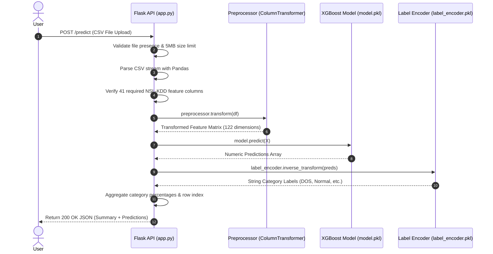

# System Architecture & Technical Design

This document details the architectural design, component interactions, and data flow of the Network Intrusion Detection System (NIDS).

---

## 1. System Overview

The system consists of three primary tiers:
1. **Data Preprocessing & Machine Learning Engine**: Dual-pipeline architecture supporting batch in-memory processing (`preprocessing.py`, `train_model.py`) and memory-bounded out-of-core streaming (`preprocessing_ooc.py`, `train_model_ooc.py`).
2. **Hardened Web Service**: Flask WSGI application (`app.py`) providing static assets, health checks, and JSON inference APIs.
3. **Container Orchestration**: Docker packaging utilizing `gunicorn` as the production WSGI server.

---

## 2. High-Level Mermaid Architecture Diagram

```mermaid
graph TB
    subgraph Client Tier
        Browser[Web Browser / API Client]
    end

    subgraph Web Service Tier (Flask)
        App[app.py - Flask Server]
        HealthCheck[GET /health]
        PredictAPI[POST /predict]
        ErrorHandler[Custom 404 / 413 / 500 Handlers]
    end

    subgraph Machine Learning Pipeline
        Preproc[preprocessing.py / ColumnTransformer]
        Encoder[LabelEncoder]
        Model[XGBoost Classifier model.pkl]
    end

    subgraph Out-of-Core Pipeline
        Scaler[RunningScaler - Welford's Algorithm]
        SGD[SGDClassifier model_ooc.pkl]
    end

    Browser -->|HTTP Request| App
    App --> HealthCheck
    App --> PredictAPI
    App --> ErrorHandler
    PredictAPI --> Preproc
    Preproc --> Model
    Model --> Encoder
    Encoder --> PredictAPI
```

---

## 3. Data Flow Diagram



---

## 4. In-Memory vs. Out-of-Core Pipelines

| Dimension | In-Memory Pipeline (`train_model.py`) | Out-of-Core Pipeline (`train_model_ooc.py`) |
| :--- | :--- | :--- |
| **Model Type** | XGBoost Classifier / RandomForest | SGDClassifier (Logistic Regression loss) |
| **Dataset Requirement** | Entire dataset held in RAM | Fixed-size streaming chunks (e.g., 10,000 rows) |
| **Scaling Algorithm** | Standard `StandardScaler` + `OneHotEncoder` | `RunningScaler` using Welford's Online Algorithm |
| **Memory Footprint** | $O(N \cdot D)$ where $N$ = total dataset rows | $O(C \cdot D)$ where $C$ = chunk size |
| **Primary Use Case** | Offline high-accuracy model training | Real-time multi-GB log file ingestion |

---

## 5. Mathematical Foundation of Welford's Algorithm

To achieve constant memory consumption during out-of-core feature scaling, `RunningScaler` implements the parallel vectorized Welford algorithm:

$$\mu_n = \mu_{n-1} + \frac{x_n - \mu_{n-1}}{n}$$

$$M_{2, n} = M_{2, n-1} + (x_n - \mu_{n-1})(x_n - \mu_n)$$

$$\sigma^2 = \frac{M_{2, n}}{n}$$

For a batch/chunk of size $N$ with mean $\bar{x}$ and squared sum $M_{2, \text{chunk}}$:

$$\Delta = \bar{x} - \mu_{\text{old}}$$

$$\mu_{\text{new}} = \mu_{\text{old}} + \Delta \cdot \frac{N}{n_{\text{old}} + N}$$

$$M_{2, \text{new}} = M_{2, \text{old}} + M_{2, \text{chunk}} + \Delta^2 \cdot \frac{n_{\text{old}} \cdot N}{n_{\text{old}} + N}$$

This vectorization eliminates Python loop overhead while maintaining float64 mathematical equivalence down to $10^{-16}$ precision.
