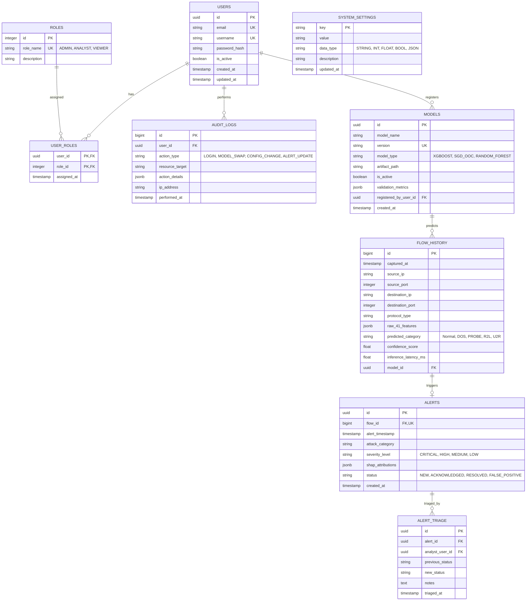

# Database Schema Design & Data Management Specification
## AI-Powered Network Intrusion Detection Platform (Version 2.0)

**Document Version:** 2.0.0-DRAFT  
**Database Engine:** PostgreSQL 15  
**ORM Engine:** SQLAlchemy 2.0 (Asyncpg)  
**Migration Tool:** Alembic  
**Status:** Approved for Implementation (Sprint 1 Ready)  
**Authors:** Database Architect & Lead Backend Engineer  

---

## 1. Entity-Relationship (ER) Diagram



---

## 2. Entity Descriptions & Schema Specifications

### 2.1 Table: `USERS`
- **Description**: Stores user identity credentials and account state.
- **Attributes**:
  - `id`: `UUID` (Primary Key, Auto-generated UUIDv4).
  - `email`: `VARCHAR(255)` (Unique, Indexed, Non-Nullable).
  - `username`: `VARCHAR(50)` (Unique, Indexed, Non-Nullable).
  - `password_hash`: `VARCHAR(255)` (Bcrypt hashed string, Non-Nullable).
  - `is_active`: `BOOLEAN` (Default: `TRUE`).
  - `created_at`: `TIMESTAMPTZ` (Default: `CURRENT_TIMESTAMP`).
  - `updated_at`: `TIMESTAMPTZ` (Default: `CURRENT_TIMESTAMP`).

### 2.2 Table: `ROLES` & `USER_ROLES`
- **Description**: Defines Role-Based Access Control (RBAC) mapping.
- **Pre-populated Roles**: `1: ADMIN`, `2: ANALYST`, `3: VIEWER`.

### 2.3 Table: `MODELS` (MLOps Model Registry)
- **Description**: Tracks versioned ML model binary artifacts and evaluation performance statistics.
- **Attributes**:
  - `id`: `UUID` (Primary Key).
  - `model_name`: `VARCHAR(100)` (Non-Nullable).
  - `version`: `VARCHAR(50)` (Unique, e.g. `v2.1.0-xgboost`).
  - `model_type`: `VARCHAR(50)` (Non-Nullable).
  - `artifact_path`: `VARCHAR(512)` (Path to `.pkl` / `.joblib` file).
  - `is_active`: `BOOLEAN` (Default: `FALSE`; exactly one model row active at a time).
  - `validation_metrics`: `JSONB` (Stores Macro F1, Recall per class, Confusion Matrix).
  - `registered_by_user_id`: `UUID` (Foreign Key $\rightarrow$ `USERS.id`).

### 2.4 Table: `FLOW_HISTORY` (Partitioned Log Table)
- **Description**: Archives historical classified network flows.
- **Attributes**:
  - `id`: `BIGSERIAL` (Primary Key).
  - `captured_at`: `TIMESTAMPTZ` (Partition Key, Non-Nullable).
  - `source_ip`: `VARCHAR(45)` (IPv4 / IPv6 string).
  - `source_port`: `INTEGER`.
  - `destination_ip`: `VARCHAR(45)`.
  - `destination_port`: `INTEGER`.
  - `protocol_type`: `VARCHAR(10)`.
  - `raw_41_features`: `JSONB` (Stores complete 41-attribute dictionary).
  - `predicted_category`: `VARCHAR(20)` (`Normal`, `DOS`, `PROBE`, `R2L`, `U2R`).
  - `confidence_score`: `DOUBLE PRECISION`.
  - `inference_latency_ms`: `DOUBLE PRECISION`.
  - `model_id`: `UUID` (Foreign Key $\rightarrow$ `MODELS.id`).

### 2.5 Table: `ALERTS` & `ALERT_TRIAGE`
- **Description**: Captures intrusion alerts flagged by the prediction engine along with analyst triage history.
- **Attributes**:
  - `id`: `UUID` (Primary Key).
  - `flow_id`: `BIGINT` (Foreign Key $\rightarrow$ `FLOW_HISTORY.id`, Unique).
  - `attack_category`: `VARCHAR(20)` (Non-Nullable).
  - `severity_level`: `VARCHAR(15)` (`CRITICAL`, `HIGH`, `MEDIUM`, `LOW`).
  - `shap_attributions`: `JSONB` (Top 5 feature importance scores).
  - `status`: `VARCHAR(20)` (`NEW`, `ACKNOWLEDGED`, `RESOLVED`, `FALSE_POSITIVE`).

### 2.6 Table: `AUDIT_LOGS`
- **Description**: Permanent audit trail of security-sensitive administrative operations.

---

## 3. Database Indexing Strategy

```
+-----------------------------------------------------------------------------------+
|                                 INDEXING STRATEGY                                 |
+-----------------------------------------------------------------------------------+
|  [B-Tree Single]   --->  `USERS.email`, `USERS.username`, `MODELS.version`        |
|  [B-Tree Composite]--->  `FLOW_HISTORY(captured_at DESC, predicted_category)`     |
|  [B-Tree Composite]--->  `ALERTS(status, severity_level, created_at DESC)`        |
|  [GIN Index]       --->  `FLOW_HISTORY.raw_41_features` (JSONB queries)         |
|  [GIN Index]       --->  `ALERTS.shap_attributions` (JSONB queries)             |
+-----------------------------------------------------------------------------------+
```

### 3.1 Specific Index Definitions
1. **Flow Query Index**: `idx_flow_history_time_cat` ON `FLOW_HISTORY (captured_at DESC, predicted_category)`
2. **Alert Filter Index**: `idx_alerts_status_severity` ON `ALERTS (status, severity_level, created_at DESC)`
3. **JSONB GIN Feature Index**: `idx_flow_features_gin` ON `FLOW_HISTORY USING GIN (raw_41_features)`
4. **Audit Query Index**: `idx_audit_user_time` ON `AUDIT_LOGS (user_id, performed_at DESC)`

---

## 4. Retention & Database Partitioning Strategy

### 4.1 Declarative Table Partitioning for `FLOW_HISTORY`
- `FLOW_HISTORY` is partitioned by range on `captured_at` into monthly tables (e.g., `flow_history_2026_08`, `flow_history_2026_09`).
- Old monthly partitions containing purely `Normal` flows are automatically pruned after 30 days via a background pg_cron job to keep database storage bounded.

### 4.2 Permanent Retention Policy
- `ALERTS`, `ALERT_TRIAGE`, `MODELS`, `USERS`, and `AUDIT_LOGS` are **never** auto-pruned. They reside on permanent primary storage.

---

## 5. Schema Migration & Versioning Strategy

1. **Alembic Version Control**: All database structural changes must be defined in Alembic revision scripts located under `alembic/versions/`.
2. **Migration Rule**: Every migration file must define both an `upgrade()` and a working `downgrade()` function to guarantee rollback capability.
3. **Automated Migration Validation**: CI/CD pipeline runs `alembic upgrade head` against a temporary Postgres container during test builds.
