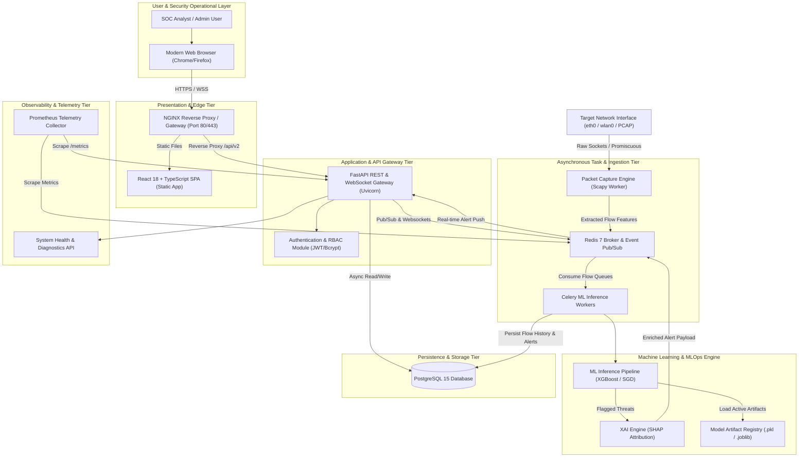
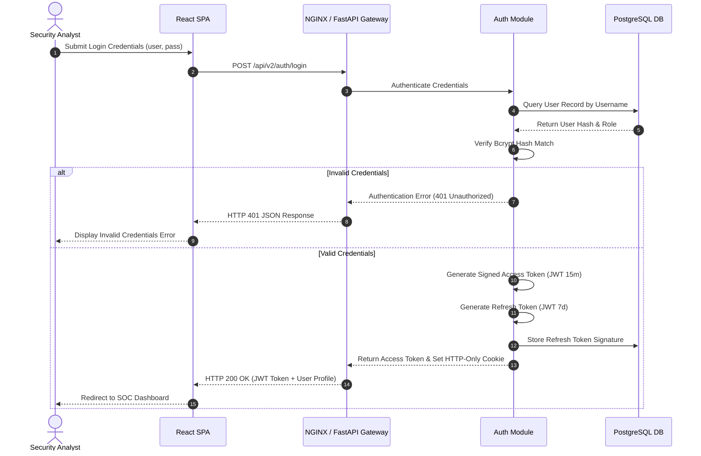
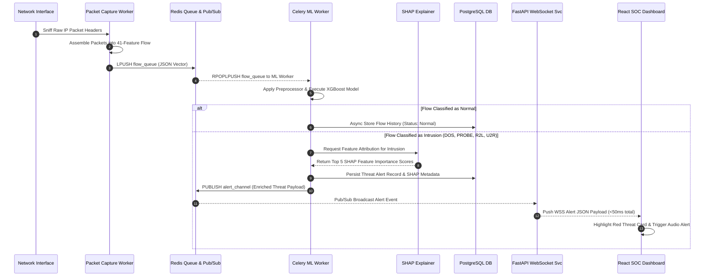
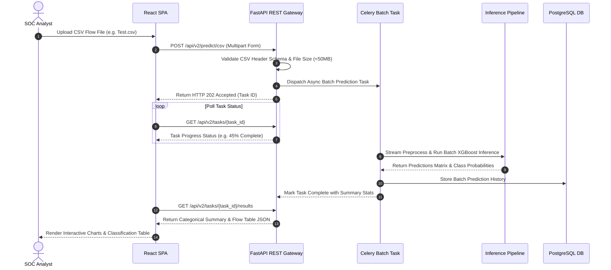
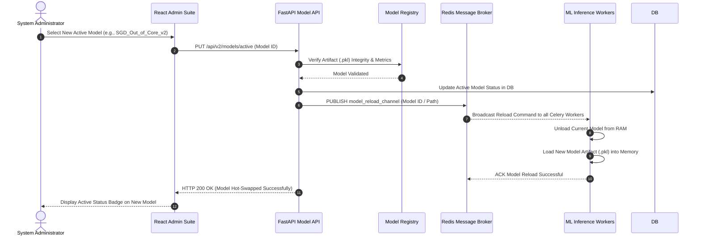
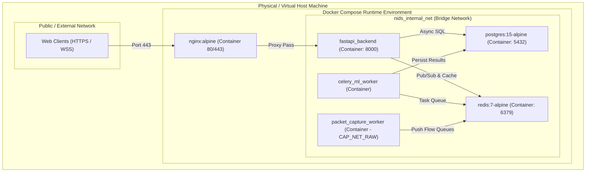

# High-Level System Architecture
## AI-Powered Network Intrusion Detection Platform (Version 2.0)

**Document Version:** 2.0.0-DRAFT  
**Standard:** ISO/IEC/IEEE 42010 Architecture Description Standard Compliant  
**Status:** Approved for Low-Level Design Phase (Phase A.2)  
**Source of Truth:** [`docs/SRS.md`](file:///d:/portfolio%20projects/NIDS/NIDS/docs/SRS.md)  
**Authors:** Enterprise Software & Infrastructure Architecture Team  
- *Principal Software Architect*  
- *Cloud Solution Architect*  
- *Senior Cybersecurity Engineer*  
- *Senior Machine Learning Engineer*  
- *Senior Backend Engineer*  
- *Senior Frontend Engineer*  
- *DevOps Architect*  

---

## 1. Architecture Goals & Design Principles

The architecture of Version 2.0 is designed to evolve the legacy monolithic, single-threaded Flask/CSV application into a decoupled, event-driven, production-quality cybersecurity platform. The architectural decisions are governed by eight core engineering principles:

```
+-----------------------------------------------------------------------------------+
|                           CORE ARCHITECTURAL PRINCIPLES                           |
+-----------------------------------------------------------------------------------+
|  1. Separation of Concerns   │ Decouple UI, API, Capture, ML, and Storage layers  |
|  2. Single Responsibility    │ Focused microservices & worker task boundaries     |
|  3. Security-by-Design       │ Zero Trust internal networking, JWT RBAC, OWASP    |
|  4. API-First Design         │ OpenAPI 3.0 contract-driven REST & WebSockets     |
|  5. Event-Driven Architecture│ Asynchronous pub/sub queueing via Redis & Celery   |
|  6. Modular MLOps            │ Dynamic hot-swappable model artifacts & versioning |
|  7. Full Observability       │ Structured JSON logs, Prometheus metrics, Health   |
|  8. Explainable AI (XAI)     │ SHAP attribution baked directly into alert flows   |
+-----------------------------------------------------------------------------------+
```

### 1.1 Separation of Concerns (SoC)
The application is strictly partitioned into independent tiers: Presentation (React SPA), API Gateway & Orchestration (FastAPI), Asynchronous Processing & Ingestion (Celery & Scapy), Data Persistence (PostgreSQL & Redis), and Observability (Prometheus). No layer direct-accesses another's internal domain storage without explicit service boundaries.

### 1.2 Single Responsibility Principle (SRP)
Every component has a single, well-defined mandate. The packet capture engine *only* sniffs packets and extracts statistical features; the inference service *only* evaluates vector matrices; the alert engine *only* routes and publishes real-time security events.

### 1.3 Security-by-Design
Security is embedded at every architectural tier rather than added as an afterthought. All internal microservices execute inside unprivileged container networks with minimal privileges (`CAP_NET_RAW` granted strictly to packet workers). API boundaries mandate TLS 1.3, input validation via strict Pydantic models, JWT token verification, and granular Role-Based Access Control (RBAC).

### 1.4 API-First Contract
All frontend-backend and service-to-service communications are governed by a strictly typed OpenAPI 3.0 specification. Backend REST and WebSocket interfaces are defined, versioned, and documented prior to client consumption.

### 1.5 Event-Driven Asynchrony
High-velocity network flow processing demands non-blocking execution pipelines. Packet ingestion and machine learning inference are decoupled from the main HTTP API request-response cycle using Redis as an event broker and pub/sub message backbone.

### 1.6 Modular MLOps Lifecycle
The Machine Learning inference engine decouples model loading from application execution. ML models are encapsulated as versioned artifacts stored in a registered model repository, enabling hot-swapping models in production without restarting active services.

### 1.7 Enterprise Observability
Every service outputs structured JSON log streams containing trace correlation IDs, exposing Prometheus `/metrics` endpoints for real-time telemetry monitoring of memory consumption, queue backlog depth, and prediction latencies.

### 1.8 Explainable AI (XAI) Native Integration
Model predictions are coupled with game-theoretic feature attribution (SHAP), giving SOC analysts instant visibility into *why* a particular flow was flagged as a specific intrusion category.

---

## 2. Overall System Architecture

The NIDS Version 2.0 platform uses a decoupled, event-driven microservices architecture hosted within a multi-container Docker orchestration environment.

### 2.1 Complete Platform Topology



---

## 3. Major System Components

```
+-----------------------------------------------------------------------------------+
|                              COMPONENT ARCHITECTURE                               |
+-----------------------------------------------------------------------------------+
|  [Presentation]   --->  React 18 + TypeScript + Tailwind CSS                      |
|  [API Gateway]    --->  FastAPI ASGI Controller                                   |
|  [Auth Service]   --->  JWT Token Engine & Bcrypt Hasher                          |
|  [Capture Engine] --->  Scapy / Socket Flow Feature Extraction Worker              |
|  [Inference Svc]  --->  Dual-Pipeline Engine (XGBoost In-Mem / SGD Out-of-Core)   |
|  [XAI Service]    --->  SHAP Attribution Explainer Engine                         |
|  [Alert Engine]   --->  WebSocket & Webhook Event Dispatcher                      |
|  [Model Registry] --->  MLOps Artifact Storage & Version Controller             |
|  [Data Store]     --->  PostgreSQL 15 Relational Event Store                      |
|  [Cache & Broker] --->  Redis 7 Pub/Sub & Memory Queue                           |
+-----------------------------------------------------------------------------------+
```

### 3.1 Presentation Component (Frontend SPA)
- **Purpose**: Provides a responsive, visual Security Operations Center (SOC) dashboard for analysts.
- **Responsibilities**:
  - Render real-time network throughput, threat distributions, and system health.
  - Stream live security alerts via persistent WebSocket connections without page refresh.
  - Provide interactive dataset filtering, threat triage controls, and PDF/CSV reporting downloads.
  - Render explainable AI (SHAP) feature attributions for flagged threats.
- **Inputs**: User interaction events, WebSocket telemetry feeds, REST JSON payloads.
- **Outputs**: HTTP API requests, UI state updates, exported PDF/CSV files.
- **Dependencies**: React 18, TypeScript, Tailwind CSS, Chart.js / Recharts, Lucide Icons.

### 3.2 Backend API & Gateway Component
- **Purpose**: Serves as the primary REST/WebSocket entry point and application orchestrator.
- **Responsibilities**:
  - Route client requests to internal services and handlers.
  - Enforce authentication, rate limiting, and CORS security policies.
  - Manage WebSocket client pools for real-time alert broadcasting.
  - Expose system health (`/health`) and metrics (`/metrics`) endpoints.
- **Inputs**: Incoming HTTP client requests, WSS connection requests, Redis pub/sub events.
- **Outputs**: JSON REST responses, WebSocket alert streams, database queries.
- **Dependencies**: FastAPI, Uvicorn, Pydantic v2, Redis Python client.

### 3.3 Authentication & RBAC Service
- **Purpose**: Manages user identity, credentials, and access permissions.
- **Responsibilities**:
  - Securely authenticate users using bcrypt password verification.
  - Issue short-lived JWT access tokens and HTTP-only refresh tokens.
  - Enforce fine-grained role permissions (`Admin`, `Analyst`, `Viewer`).
- **Inputs**: Login credentials (`username`, `password`), JWT tokens.
- **Outputs**: Signed JWT bearer tokens, authorized user session context.
- **Dependencies**: PyJWT, passlib (bcrypt), FastAPI Security utilities.

### 3.4 Packet Capture & Flow Ingestion Service
- **Purpose**: Sniffs raw network packets and constructs 41 NSL-KDD compliant flow statistical vectors in real time.
- **Responsibilities**:
  - Bind to designated OS network interfaces in promiscuous mode.
  - Aggregate packet statistics over sliding time windows (duration, byte counts, TCP flags, ICMP error rates).
  - Push assembled flow vectors into Redis ingestion queues.
- **Inputs**: Raw IP network packets from socket interfaces or offline `.pcap` files.
- **Outputs**: Structured 41-feature JSON flow vectors pushed to Redis.
- **Dependencies**: Scapy, PyPcap, Linux Sockets (`socket.AF_PACKET`), NumPy.

### 3.5 ML Inference & Prediction Service
- **Purpose**: Evaluates flow feature matrices against machine learning models to detect network intrusions.
- **Responsibilities**:
  - Preprocess flow vectors using pre-fitted `StandardScaler` and `ColumnTransformer` pipelines.
  - Execute inference using active model artifacts (High-Accuracy XGBoost or Out-of-Core SGD).
  - Categorize flows into 5 primary classes (`Normal`, `DOS`, `PROBE`, `R2L`, `U2R`) with probability vectors.
- **Inputs**: 41-feature flow vectors from Redis task queues.
- **Outputs**: Threat classification labels, probability vectors, inference latency metrics.
- **Dependencies**: Scikit-Learn, XGBoost, NumPy, Joblib/Pickle.

### 3.6 Explainable AI (XAI) Service
- **Purpose**: Generates feature contribution attributions explaining model decisions for detected intrusions.
- **Responsibilities**:
  - Calculate TreeSHAP / LinearSHAP values for flagged malicious network flows.
  - Extract the top 5 statistical features contributing to an intrusion classification.
- **Inputs**: Flagged malicious flow feature vectors, active model artifact.
- **Outputs**: SHAP feature importance attribution map attached to the threat payload.
- **Dependencies**: SHAP library, NumPy.

### 3.7 Alert & Notification Engine
- **Purpose**: Processes prediction results and dispatches alerts to internal and external consumers.
- **Responsibilities**:
  - Compare prediction probabilities against configured category thresholds.
  - Publish high-severity alert payloads to Redis Pub/Sub channels for UI WebSocket push.
  - Dispatch outbound Webhook notifications (Slack/Discord/Custom HTTP) for critical attacks.
- **Inputs**: Prediction results from Celery workers.
- **Outputs**: Redis Pub/Sub alert messages, HTTP Webhook POST requests.
- **Dependencies**: Redis Pub/Sub, HTTPX async HTTP client.

### 3.8 Model Management Service (MLOps)
- **Purpose**: Regulates the lifecycle, storage, versioning, and evaluation of ML models.
- **Responsibilities**:
  - Upload, validate, and store `.pkl` model artifacts in the Model Registry.
  - Hot-swap active classification models in production without restarting inference workers.
  - Track validation metrics (Accuracy, Macro F1, Recall per class).
- **Inputs**: Model binary files, validation test datasets.
- **Outputs**: Active model state updates, benchmark comparison tables.
- **Dependencies**: Joblib, File System / S3 storage, Scikit-learn evaluation metrics.

### 3.9 Persistence Component (PostgreSQL)
- **Purpose**: Serves as the primary relational database for permanent system records.
- **Responsibilities**:
  - Persist user credentials, roles, and session audit logs.
  - Store historical classified network flows and alert histories.
  - Store model registry metadata and global configuration settings.
- **Inputs**: Async ORM SQL read/write commands from FastAPI and Celery.
- **Outputs**: Relational query result sets.
- **Dependencies**: PostgreSQL 15, Asyncpg, SQLAlchemy 2.0, Alembic.

### 3.10 In-Memory Broker & Cache Component (Redis)
- **Purpose**: Serves as high-speed message broker, event pub/sub channel, and ephemeral cache.
- **Responsibilities**:
  - Buffer incoming real-time network flow queues between Packet Capture and ML Workers.
  - Broadcast real-time security alerts from Workers to API WebSockets.
  - Cache active session state, rate limit counters, and system health status.
- **Inputs**: Flow vectors, alert payloads, cache key-value operations.
- **Outputs**: Queued task items, pub/sub subscription streams.
- **Dependencies**: Redis 7.

---

## 4. Data Flow Architecture

### 4.1 Sequence Diagram: User Authentication & JWT Issuance



### 4.2 Sequence Diagram: Real-Time Live Packet Capture & Threat Alerting



### 4.3 Sequence Diagram: Batch CSV File Prediction Workflow



### 4.4 Sequence Diagram: Hot-Swapping Machine Learning Models



---

## 5. System Boundaries & Interface Isolation

```
+-----------------------------------------------------------------------------------+
|                                 SYSTEM BOUNDARIES                                 |
+-----------------------------------------------------------------------------------+
|  [External Network]  --->  Bound via OS Native Raw Sockets (CAP_NET_RAW)          |
|  [Client Browsers]   --->  Bound via TLS 1.3 NGINX Reverse Proxy (Port 443)      |
|  [External Webhooks] --->  Outbound HTTPS JSON Payloads to Slack/Discord          |
|  [Internal Services] --->  Isolated Docker Container Network (No Direct WAN Access)|
+-----------------------------------------------------------------------------------+
```

### 5.1 Internal Components (Private Network Scope)
- **FastAPI Application Server**: Accessible only via the NGINX reverse proxy.
- **Celery Inference & Capture Workers**: No public port exposures; interacts exclusively via Redis queues and PostgreSQL sockets.
- **PostgreSQL Database**: Isolated within container network (`nids_internal_net`), accepting connections only from FastAPI and Celery workers.
- **Redis Cache & Broker**: Bound to container network with password authentication; no exposure to external interfaces.

### 5.2 External Interfaces & Systems
- **Client Web Browsers**: Interacts over public HTTPS (Port 443) and Secure WebSockets (`wss://`).
- **External Webhook Targets**: Outbound HTTPS connections to user-defined Slack, Discord, or SIEM endpoints.
- **Target Network Interfaces**: System binds to OS physical (`eth0`, `wlan0`) or virtual (`veth`) NICs via kernel raw sockets.

### 5.3 Operating System Dependencies
- **Linux Capabilities**: Requires `CAP_NET_RAW` and `CAP_NET_ADMIN` privileges for packet capture workers.
- **WSL2 / Docker Engine**: Container virtualization layer hosting microservices.

---

## 6. Technology Mapping

| Layer / Subsystem | Technology Selected | Version | Architectural Rationale |
| :--- | :--- | :--- | :--- |
| **Frontend Framework** | React | `18.2.0` | Declarative, component-driven UI library ideal for high-frequency dashboard updates. |
| **Frontend Language** | TypeScript | `5.1.0` | Strict static typing prevents runtime client errors across complex telemetry objects. |
| **UI Styling & Icons** | Tailwind CSS & Lucide | `3.3.0` | Utility-first styling for dark-mode, responsive SOC interface designs. |
| **Data Visualization**| Chart.js / Recharts | `4.3.0` | Canvas-accelerated charting performance for live packet rate & threat distribution charts. |
| **Backend API Framework**| FastAPI | `0.100.0` | Asynchronous Python ASGI framework providing high throughput, Pydantic validation, and auto OpenAPI docs. |
| **ASGI Web Server** | Uvicorn | `0.22.0` | Lightning-fast asynchronous server implementation based on `uvloop` and `httptools`. |
| **Packet Capture Engine**| Scapy | `2.5.0` | Comprehensive packet manipulation library for low-level header extraction and flow feature calculation. |
| **Inference Engine** | XGBoost & Scikit-Learn | `1.7.0 / 1.3.0` | Industry-standard ensemble models delivering state-of-the-art tabular classification accuracy. |
| **Out-of-Core Processing**| Scikit-Learn `SGDClassifier`| `1.3.0` | Incremental linear classifier supporting `.partial_fit()` for memory-bounded processing. |
| **Explainable AI (XAI)**| SHAP | `0.42.0` | Game-theoretic feature attribution providing mathematical transparency for intrusion predictions. |
| **Task Queue & Workers**| Celery | `5.3.0` | Asynchronous distributed task queue for heavy ML inference and packet capture loops. |
| **In-Memory Broker** | Redis | `7.0.0` | In-memory key-value store functioning as message broker, pub/sub channel, and rate-limiting cache. |
| **Relational Database**| PostgreSQL | `15.0` | Enterprise-grade transactional relational database with JSONB support and async drivers. |
| **Database ORM** | SQLAlchemy & Alembic | `2.0.0` | Asynchronous ORM providing type-safe SQL operations and schema migration management. |
| **Containerization** | Docker & Docker Compose | `24.0 / v2` | Portable multi-container packaging and unified microservice orchestration. |
| **Reverse Proxy** | NGINX | `1.24.0` | High-performance reverse proxy handling SSL termination, static file serving, and rate limiting. |

---

## 7. Security Architecture

```
                                [INCOMING CLIENT TRAFFIC]
                                            │
                                            ▼
                             ┌──────────────────────────────┐
                             │    NGINX Reverse Proxy       │
                             │  - TLS 1.3 Termination       │
                             │  - Rate Limiting (100 req/m) │
                             └──────────────┬───────────────┘
                                            │
                                            ▼
                             ┌──────────────────────────────┐
                             │   FastAPI Gateway Security   │
                             │  - CORS Policy Enforcement    │
                             │  - Pydantic Input Validation  │
                             │  - JWT Bearer Verification   │
                             └──────────────┬───────────────┘
                                            │
                                            ▼
                             ┌──────────────────────────────┐
                             │    RBAC Permission Filter    │
                             │  - [Admin / Analyst / Viewer]│
                             └──────────────┬───────────────┘
                                            │
                                            ▼
                             ┌──────────────────────────────┐
                             │ Isolated Container Network   │
                             │  - Non-root Execution Users  │
                             │  - CAP_NET_RAW Least Priv    │
                             └──────────────────────────────┘
```

### 7.1 Authentication & JWT Token Management
- **Password Hashing**: Passwords stored exclusively as salted `bcrypt` hashes ($cost \ge 12$).
- **Dual Token Lifecycle**:
  - **Access Token**: Short-lived (15 minutes), signed with SHA-256 JWT, passed via `Authorization: Bearer <token>` header.
  - **Refresh Token**: Long-lived (7 days), stored in secure `HTTP-Only`, `SameSite=Strict`, `Secure` cookies.

### 7.2 Authorization & Role-Based Access Control (RBAC)
- **Role Hierarchy**:
  - `Admin`: Full permissions (User management, Model upload/switching, Capture triggers, System configs).
  - `Analyst`: Operational permissions (View dashboard, triage alerts, trigger CSV predictions, export reports).
  - `Viewer`: Read-only access to dashboard statistics.

### 7.3 Data Protection & Input Sanitization
- **Strict Schema Enforcement**: All API input payloads validated using Pydantic v2 schemas; invalid types or extra fields are rejected immediately (`HTTP 422`).
- **SQL Injection Prevention**: All database interactions use SQLAlchemy 2.0 parameterized queries; raw SQL concatenation is strictly prohibited.
- **XSS & CSRF Protection**: React automatically escapes rendered values; cookies utilize `SameSite=Strict` and `HTTP-Only` flags.

### 7.4 Network & Container Hardening
- **Least Privilege Execution**: Docker containers run under dedicated unprivileged system accounts (`uid 10001`).
- **Container Isolation**: Internal microservices communicate strictly within Docker's isolated virtual network (`nids_internal_net`); database and Redis ports are not exposed on the host's public interfaces.

---

## 8. Deployment Architecture

### 8.1 Multi-Container Docker Topology



### 8.2 Production Container Compose Specification Strategy
- **`docker-compose.yml`**: Defines the unified microservice layout:
  - `frontend_nginx`: Reverse proxy serving built React assets and proxying `/api/v2` requests.
  - `backend_api`: Scalable FastAPI instances running Uvicorn ASGI processes.
  - `celery_worker`: Background workers executing machine learning predictions and SHAP calculations.
  - `packet_sniffer`: Isolated container granted `cap_add: [NET_ADMIN, NET_RAW]` binding to host NIC.
  - `postgres_db`: Persistent relational storage with named Docker volumes (`postgres_data`).
  - `redis_broker`: In-memory broker with persistence enabled (`appendonly yes`).

### 8.3 Future Kubernetes Readiness (Cloud-Native Roadmap)
The decoupled container architecture is pre-configured for Kubernetes deployment:
- **Stateless API Tiers**: `backend_api` and `frontend_nginx` can be deployed as Kubernetes Deployments with Horizontal Pod Autoscalers (HPA).
- **Stateful Ingestion & Storage**: PostgreSQL and Redis map cleanly to Kubernetes StatefulSets with Persistent Volume Claims (PVCs).
- **DaemonSet Capture**: Packet capture workers can deploy as DaemonSets across cluster nodes to capture multi-node network traffic.

---

## 9. Observability & Telemetry Architecture

```
+-----------------------------------------------------------------------------------+
|                            OBSERVABILITY STACK                                    |
+-----------------------------------------------------------------------------------+
|  Structured JSON Logs  ---> Timestamp, Log Level, Service Name, Correlation ID    |
|  Prometheus Metrics   ---> Exposed at /metrics (Latency, Request Rate, Queue Depth)|
|  Health Checks        ---> Live (/health/live) & Readiness (/health/ready)         |
|  Audit Trail          ---> Permanent PostgreSQL audit log for administrative actions|
+-----------------------------------------------------------------------------------+
```

### 9.1 Structured JSON Logging
All Python microservices utilize `structlog` to emit uniform, machine-readable JSON logs to `stdout`/`stderr`:
```json
{
  "timestamp": "2026-08-04T00:22:10Z",
  "level": "INFO",
  "service": "ml_inference_worker",
  "correlation_id": "req-9a8b7c6d-5e4f",
  "event": "threat_detected",
  "flow_id": "flw-102938",
  "predicted_class": "U2R",
  "confidence": 0.942,
  "inference_latency_ms": 8.45
}
```

### 9.2 Prometheus Metrics Exporter
The FastAPI backend exposes a standard `/metrics` endpoint collecting key operational metrics:
- `nids_http_requests_total`: Counter tracking HTTP request volume by endpoint and status code.
- `nids_inference_latency_seconds`: Histogram tracking ML prediction latency distribution.
- `nids_threats_detected_total`: Counter tracking detected intrusions by attack category (`DOS`, `PROBE`, `R2L`, `U2R`).
- `nids_packet_queue_depth`: Gauge tracking current unparsed flows pending in Redis.

### 9.3 Health & Readiness Probes
- `/health/live`: Returns `HTTP 200` if the container process is running.
- `/health/ready`: Checks database ping, Redis connectivity, and active ML model load before returning `HTTP 200 OK` (used by Docker and Kubernetes orchestrators).

---

## 10. Scalability & Performance Strategy

```
+-----------------------------------------------------------------------------------+
|                              SCALABILITY STRATEGY                                 |
+-----------------------------------------------------------------------------------+
|  [Horizontal Worker Scaling] ---> Spin up additional Celery containers on Redis queue |
|  [Asynchronous Non-Blocking] ---> FastAPI Uvicorn async request loop              |
|  [In-Memory Caching]         ---> Redis caches active model state & system stats    |
|  [Database Optimization]     ---> PostgreSQL Async Connection Pools & Indexes     |
+-----------------------------------------------------------------------------------+
```

### 10.1 Horizontal Scaling of ML Workers
When network packet volume spikes, additional `celery_ml_worker` containers can be dynamically spun up using `docker-compose scale celery_worker=4`. Workers pull flow tasks concurrently from the shared Redis `flow_queue`, distributing inference load linearly across available CPU cores.

### 10.2 Asynchronous I/O Execution
FastAPI handles client connections using Python's `asyncio` event loop. Slow I/O operations (database queries, network socket reads, external webhooks) are executed asynchronously, allowing a single API worker to handle thousands of concurrent WebSocket connections.

### 10.3 Database Query & Indexing Strategy
- Primary foreign keys (`user_id`, `model_id`), timestamps (`created_at`), and categorical threat tags (`predicted_class`) are indexed using B-Tree indexes.
- Historical flow tables utilize PostgreSQL declarative partitioning by month to maintain fast query performance as logs accumulate.

---

## 11. Failure Recovery & Resiliency Architecture

| Failure Scenario | Circuit Breaker / Detection Mechanism | Automated Recovery Strategy |
| :--- | :--- | :--- |
| **Active ML Model Artifact Corrupted / Missing** | Model loading exception caught during worker initialization. | System falls back automatically to default pre-packaged fallback model artifact (`sgd_fallback.pkl`) and fires an administrative warning alert. |
| **PostgreSQL Database Outage** | Database connection ping timeout in SQLAlchemy pool. | Ingestion and inference workers switch to buffering alerts into Redis persistent memory queue (`appendonly`). Once DB reconnects, buffered events are flushed asynchronously. |
| **Redis Broker Failure / Crash** | Connection refusal caught by API gateway and packet sniffer. | Packet capture worker buffers incoming flows in local thread memory ring buffer (up to 10,000 flows). API falls back to polling database for UI updates. |
| **Packet Capture Sockets Overwhelmed** | Kernel buffer packet drop rate exceeds threshold. | Packet sniffer enables selective BPF filtering, dropping non-IP or non-TCP/UDP control traffic to maintain capture stability. |
| **Celery Worker Crash / Out-of-Memory** | Celery supervisor process detects dead worker process. | Celery master automatically spawns replacement worker instance; unacknowledged task in Redis queue is re-queued (`visibility_timeout`) and processed by another worker. |

---

## 12. Future Expansion Roadmap (Version 3.0 Integration)

Version 2.0 architecture is designed with clear extension points, allowing seamless addition of Version 3.0 features without modifying or refactoring Version 2.0 core code:

```
+-----------------------------------------------------------------------------------+
|                          VERSION 3.0 EXTENSION POINTS                             |
+-----------------------------------------------------------------------------------+
|  [Active IPS Blocking]    ---> Add IPTables / eBPF XDP Consumer to Redis Alert Pub |
|  [Distributed Edge Agents]---> Add gRPC Receiver Module to FastAPI Ingestion Tier  |
|  [Deep Learning Models]   ---> Add PyTorch / ONNX Runtime Plugin to ML Engine     |
+-----------------------------------------------------------------------------------+
```

1. **Active Intrusion Prevention (NIPS)**:
   - *V3.0 Enhancement*: Automated IP blocking via Linux `iptables` / `eBPF XDP`.
   - *V2.0 Extension Point*: A new lightweight NIPS daemon subscribes to Redis `alert_channel`. When a `Critical` (U2R/R2L) alert payload is published, the NIPS worker executes kernel drop rules for the offending Source IP without changing any API or ML code.
2. **Distributed Multi-Agent Edge Sniffing**:
   - *V3.0 Enhancement*: Remote edge agents installed across campus/cloud subnets sending packet flows to central collector.
   - *V2.0 Extension Point*: FastAPI exposes a gRPC / Protobuf ingestion endpoint `/api/v3/ingest/stream`. Edge agents stream pre-calculated flow vectors directly into the existing Redis `flow_queue`.
3. **Deep Learning Sequence Models (BiLSTM / Transformers)**:
   - *V3.0 Enhancement*: Advanced neural sequence classification.
   - *V2.0 Extension Point*: The ML Model Registry supports `.onnx` and `.pt` model binaries alongside existing `.pkl` artifacts. Inference workers load ONNX Runtime engines without changing feature pipelines.

---

## 13. Architectural Decision Records (ADRs)

### ADR-001: Selection of FastAPI over Flask for Backend Framework
- **Status**: Approved
- **Context**: Version 1.0 utilized Flask. Version 2.0 requires real-time WebSockets, async database drivers, automatic OpenAPI documentation, and high concurrency.
- **Decision**: Migrate to FastAPI.
- **Rationale**: FastAPI natively supports asynchronous execution (`async`/`await`), provides automatic request validation via Pydantic, and achieves up to 3x higher throughput compared to traditional WSGI Flask applications under high concurrent request loads.

### ADR-002: Selection of PostgreSQL over MongoDB for Relational Persistence
- **Status**: Approved
- **Context**: System must store structured user accounts, strict RBAC roles, audit logs, model registry metadata, and historical alert records.
- **Decision**: Select PostgreSQL 15.
- **Rationale**: PostgreSQL offers strict ACID compliance, powerful relational indexing, native JSONB support for flexible flow feature storage, and excellent asynchronous Python driver support (`asyncpg`).

### ADR-003: Selection of React + TypeScript for Frontend Interface
- **Status**: Approved
- **Context**: Version 1.0 used static Jinja2 HTML templates. Version 2.0 demands a real-time, highly interactive SOC dashboard.
- **Decision**: Build a Single-Page Application (SPA) using React 18 and TypeScript.
- **Rationale**: React's component model and virtual DOM enable efficient rendering of high-frequency telemetry charts and alert tables. TypeScript enforces strict client-side data safety.

### ADR-004: Selection of Docker & Docker Compose for Deployment Packaging
- **Status**: Approved
- **Context**: Software must deploy predictably across development, testing, and portfolio evaluation environments without manual dependency management.
- **Decision**: Standardize on Docker containerization orchestrations.
- **Rationale**: Containerization eliminates "works on my machine" issues, isolates OS dependencies (like Scapy raw sockets), and provides a clean single-command deployment path (`docker-compose up --build`).

### ADR-005: Selection of Scapy for Real-Time Packet Capture
- **Status**: Approved
- **Context**: Real-time traffic ingestion requires extracting 41 statistical attributes matching the NSL-KDD schema from raw IP packets.
- **Decision**: Use Scapy integrated with raw Linux sockets.
- **Rationale**: Scapy provides comprehensive protocol parsing (TCP, UDP, ICMP, IP flags) and header inspection in Python, enabling rapid prototyping of flow window aggregators.

### ADR-006: Selection of XGBoost for Primary In-Memory Inference
- **Status**: Approved
- **Context**: High-accuracy threat detection requires handling non-linear tabular flow features with extreme class imbalance.
- **Decision**: Utilize XGBoost as the primary in-memory classifier.
- **Rationale**: XGBoost demonstrated superior Macro F1 performance (`0.5684` V1.0 baseline, target `≥0.85` V2.0) compared to Random Forest and simple linear models, while offering fast tree-based inference execution.

### ADR-007: Selection of SHAP for Explainable AI (XAI)
- **Status**: Approved
- **Context**: Security analysts require mathematical transparency into why an AI model classified a network connection as malicious.
- **Decision**: Integrate SHAP (SHapley Additive exPlanations).
- **Rationale**: SHAP provides game-theoretic feature attribution scores, allowing exact calculation of feature contribution vectors for individual flows, significantly boosting trust and triage efficiency in SOC operations.
