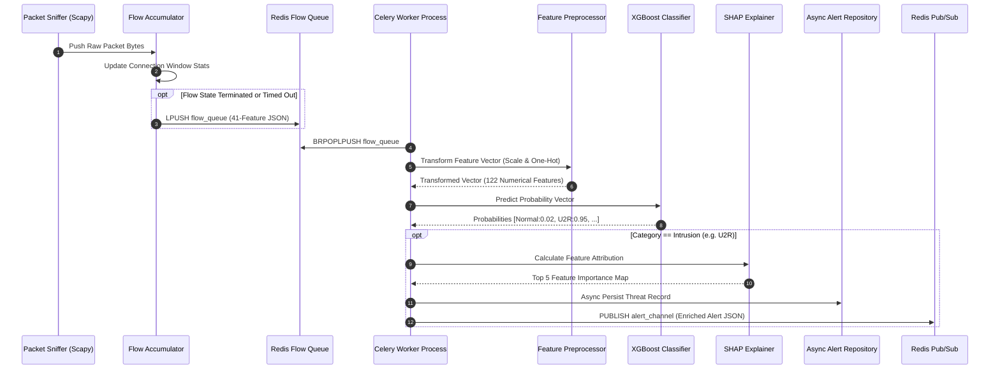

# Low-Level System Design & Engineering Blueprint
## AI-Powered Network Intrusion Detection Platform (Version 2.0)

**Document Version:** 2.0.0-DRAFT  
**Standard:** IEEE 1016-2009 Software Design Document Compliant  
**Status:** Approved for Implementation (Sprint 1 Ready)  
**Source of Truth:** [`docs/SRS.md`](file:///d:/portfolio%20projects/NIDS/NIDS/docs/SRS.md) & [`docs/HighLevelArchitecture.md`](file:///d:/portfolio%20projects/NIDS/NIDS/docs/HighLevelArchitecture.md)  
**Authors:** Lead Backend Engineer & Principal Software Architect  

---

## 1. Clean Architecture Package Structure

The backend application is structured around **Clean Architecture** and **Domain-Driven Design (DDD)** principles to enforce decoupling, strict dependency direction, and unit testability.

```
app/
├── core/                   # Infrastructure Cross-Cutting Concerns
│   ├── config.py           # Pydantic BaseSettings Environment Loader
│   ├── security.py         # JWT Token & Bcrypt Password Hashing
│   ├── logging.py          # Structlog JSON Formatting & Correlation IDs
│   ├── exceptions.py       # Domain Custom Exception Definitions
│   └── database.py         # SQLAlchemy Async Session & Redis Engine Pools
│
├── domain/                 # Pure Business Domain Logic & Entities (No External Frameworks)
│   ├── entities/           # Domain Dataclasses (User, Flow, Alert, ModelArtifact)
│   ├── interfaces/         # Abstract Base Classes (Repositories, Predictive Engine)
│   └── value_objects/      # Immutable Enums (AttackCategory, SeverityLevel, UserRole)
│
├── services/               # Application Use-Case Orchestration
│   ├── auth_service.py     # Authentication, Token Refresh & Password Management
│   ├── prediction_service.py # Inference Routing, Preprocessing & SHAP Execution
│   ├── capture_service.py  # Packet Aggregation Windowing & Flow Formatting
│   ├── alert_service.py     # Threshold Evaluation, Aggregation & Webhook Dispatch
│   ├── model_service.py    # Model Registry, Hot-Swapping & Evaluation Benchmarks
│   └── report_service.py   # PDF / CSV Export File Generator
│
├── infrastructure/         # External System Adapters & Implementations
│   ├── repositories/       # SQLAlchemy Async ORM Repositories
│   ├── ml/                 # XGBoost & SGD Model Handlers, Preprocessors & SHAP
│   ├── packet_capture/     # Scapy Native Socket Sniffer & Flow Accumulator
│   └── messaging/          # Redis Pub/Sub & Celery Task Queue Implementations
│
└── api/                    # Presentation & Delivery Layer (FastAPI)
    ├── dependencies.py     # FastAPI Dependency Injection (Auth, DB, Services)
    ├── middleware.py       # Correlation ID, Rate Limiting & Exception Mapping
    └── v2/                 # Version 2 API Route Controllers
        ├── auth.py         # Authentication Endpoints
        ├── predict.py      # Real-time & Batch CSV Inference Routes
        ├── capture.py      # Network Interface Controls
        ├── alerts.py       # Alert Management & Triage
        ├── models.py       # MLOps Model Registry Routes
        ├── reports.py      # Exporting Endpoints
        └── system.py      # Health Checks & System Telemetry
```

---

## 2. Dependency Direction & Interaction Rules

```
     ┌─────────────────────────────────────────────────────────┐
     │                      API Layer                          │
     │            (FastAPI Routes & Middlewares)               │
     └──────────────────────────┬──────────────────────────────┘
                                │
                                ▼
     ┌─────────────────────────────────────────────────────────┐
     │                   Application Services                  │
     │      (Auth, Prediction, Capture, Alert Services)        │
     └──────────────────────────┬──────────────────────────────┘
                                │
                                ▼
     ┌─────────────────────────────────────────────────────────┐
     │                     Domain Interfaces                   │
     │        (Abstract Repositories & Engine Contracts)       │
     └──────────────────────────▲──────────────────────────────┘
                                │ (Implements)
     ┌──────────────────────────┴──────────────────────────────┐
     │                 Infrastructure Adapters                 │
     │     (SQLAlchemy DB, XGBoost ML, Scapy, Redis Message)   │
     └─────────────────────────────────────────────────────────┘
```

1. **Inner Tiers Never Depend on Outer Tiers**: `domain/` contains zero imports from `infrastructure/`, `services/`, or `api/`.
2. **Interface Inversion**: Services depend solely on `domain/interfaces/`. Infrastructure components implement these interfaces.
3. **Dependency Injection**: FastAPI `Depends()` resolves concrete infrastructure classes at runtime.

---

## 3. Core Component Responsibilities & Interface Specifications

### 3.1 Inference Engine Interface (`InferenceEngineInterface`)
- **Responsibility**: Standardize classification calls across XGBoost (in-memory) and SGD (out-of-core) model implementations.
- **Contract Methods**:
  - `predict(features: List[float]) -> InferenceResultDTO`
  - `predict_batch(matrix: List[List[float]]) -> List[InferenceResultDTO]`
  - `compute_shap(features: List[float]) -> Dict[str, float]`
  - `load_artifact(artifact_path: str) -> bool`

### 3.2 Packet Flow Accumulator (`FlowAccumulator`)
- **Responsibility**: Maintain active socket connection state buffers, aggregate raw TCP/UDP/ICMP packet metrics, and format them into 41-attribute flow vectors.
- **Contract Methods**:
  - `process_packet(raw_packet: bytes) -> Optional[FlowRecordDTO]`
  - `flush_stale_flows(timeout_seconds: float) -> List[FlowRecordDTO]`
  - `set_bpf_filter(bpf_expression: str) -> bool`

### 3.3 Alert Dispatcher (`AlertDispatcherInterface`)
- **Responsibility**: Evaluate prediction output against categorical risk rules and route payloads to WebSockets and external webhooks.
- **Contract Methods**:
  - `dispatch_alert(alert: AlertDTO) -> TaskAckDTO`
  - `deduplicate_alert(alert: AlertDTO, window_seconds: int) -> bool`

---

## 4. Sequence Diagram: Live Flow Ingestion & Inference Execution



---

## 5. Data Transfer Objects (DTO) Design

All data crossing layer boundaries is strictly encapsulated in immutable **Pydantic v2** models.

### 5.1 Auth DTOs
```python
# Conceptual DTO Specification
class UserLoginDTO:
    username: str  # min_length=3, max_length=50
    password: str  # min_length=12

class TokenResponseDTO:
    access_token: str
    refresh_token: str
    token_type: str = "Bearer"
    expires_in: int = 900  # 15 minutes
```

### 5.2 Flow Feature DTO
```python
class NetworkFlowDTO:
    duration: float
    protocol_type: str  # tcp, udp, icmp
    service: str       # http, smtp, ftp, etc.
    flag: str          # SF, S0, REJ, etc.
    src_bytes: int
    dst_bytes: int
    land: int
    wrong_fragment: int
    urgent: int
    hot: int
    num_failed_logins: int
    logged_in: int
    num_compromised: int
    root_shell: int
    su_attempted: int
    num_root: int
    num_file_creations: int
    num_shells: int
    num_access_files: int
    is_host_login: int
    is_guest_login: int
    count: int
    srv_count: int
    serror_rate: float
    srv_serror_rate: float
    rerror_rate: float
    srv_rerror_rate: float
    same_srv_rate: float
    diff_srv_rate: float
    srv_diff_host_rate: float
    dst_host_count: int
    dst_host_srv_count: int
    dst_host_same_srv_rate: float
    dst_host_diff_srv_rate: float
    dst_host_same_src_port_rate: float
    dst_host_srv_diff_host_rate: float
    dst_host_serror_rate: float
    dst_host_srv_serror_rate: float
    dst_host_rerror_rate: float
    dst_host_srv_rerror_rate: float
```

### 5.3 Prediction Result DTO
```python
class PredictionResultDTO:
    predicted_category: str  # Normal, DOS, PROBE, R2L, U2R
    confidence: float        # Range 0.0 to 1.0
    probabilities: Dict[str, float]
    shap_attributions: Optional[Dict[str, float]]
    inference_latency_ms: float
    model_version: str
```

---

## 6. Error Handling Strategy

### 6.1 Custom Domain Exception Hierarchy
All errors inherit from a root `NIDSException` to ensure unified catch and mapping logic:

```
NIDSException (Base)
├── AuthenticationError (HTTP 401)
├── PermissionDeniedError (HTTP 403)
├── ResourceNotFoundError (HTTP 404)
├── ValidationError (HTTP 422)
├── ModelInferenceError (HTTP 500)
├── PacketCaptureError (HTTP 500)
└── DatabaseConnectionError (HTTP 503)
```

### 6.2 Global FastAPI Exception Handler Middleware
System converts all unhandled domain exceptions into standard RFC 7807 problem detail JSON responses:
```json
{
  "type": "https://api.nids.local/errors/model-inference-error",
  "title": "Model Inference Failure",
  "status": 500,
  "detail": "Failed to execute prediction: Model artifact 'xgb_v2.pkl' corrupted or unreadable.",
  "instance": "/api/v2/predict/batch",
  "correlation_id": "req-8f9e0a1b-2c3d"
}
```

---

## 7. Configuration Management Strategy

Configuration settings are loaded via **Pydantic BaseSettings**, parsing environment variables (`.env`) with automatic type casting and validation.

### 7.1 Configuration Matrix

| Environment Variable | Default Value | Validation Constraint | Description |
| :--- | :--- | :--- | :--- |
| `ENVIRONMENT` | `production` | `development \| staging \| production` | System execution environment. |
| `SECRET_KEY` | *None* | `min_length=32` (Required) | Secret key for JWT signature generation. |
| `DATABASE_URL` | *None* | Valid PostgreSQL URI | Async SQLAlchemy database connection string. |
| `REDIS_URL` | `redis://redis:6379/0` | Valid Redis URI | Message broker and cache connection URI. |
| `ACTIVE_MODEL_PATH` | `artifacts/models/xgb_v1.pkl` | Existing file path | Primary machine learning model artifact path. |
| `SHAP_ENABLED` | `true` | `boolean` | Flag to enable SHAP feature attribution calculation. |
| `SNIFFER_INTERFACE` | `eth0` | Non-empty string | Target network interface for packet capture. |
| `LOG_LEVEL` | `INFO` | `DEBUG \| INFO \| WARNING \| ERROR` | Logging verbosity level. |

---

## 8. Logging & Observability Strategy

### 8.1 Structured JSON Formatting
Logging utilizes `structlog` to output key-value JSON objects containing automatic correlation IDs:

```json
{
  "timestamp": "2026-08-04T00:35:14Z",
  "level": "WARNING",
  "event": "intrusion_alert_generated",
  "correlation_id": "c1092a83-7b4c",
  "attack_category": "U2R",
  "confidence": 0.965,
  "source_ip": "192.168.1.105",
  "destination_port": 22
}
```

### 8.2 Log Correlation ID Propagation
1. Incoming HTTP requests check for `X-Correlation-ID` header; if missing, generate a new UUIDv4.
2. The correlation ID is attached to the request context and injected into all database queries, Redis publish events, and Celery task headers.

---

## 9. Dependency Injection Strategy

Dependencies are injected lazily using FastAPI’s `Depends()` provider pattern:

```python
# Conceptual DI Contract Design
async def get_db_session() -> AsyncGenerator[AsyncSession, None]:
    async with AsyncSessionLocal() as session:
        yield session

async def get_prediction_service(
    session: AsyncSession = Depends(get_db_session),
    broker: RedisBroker = Depends(get_redis_broker)
) -> PredictionService:
    repository = SQLAlertRepository(session)
    engine = XGBoostInferenceEngine(path=settings.ACTIVE_MODEL_PATH)
    return PredictionService(engine=engine, repository=repository, broker=broker)
```
