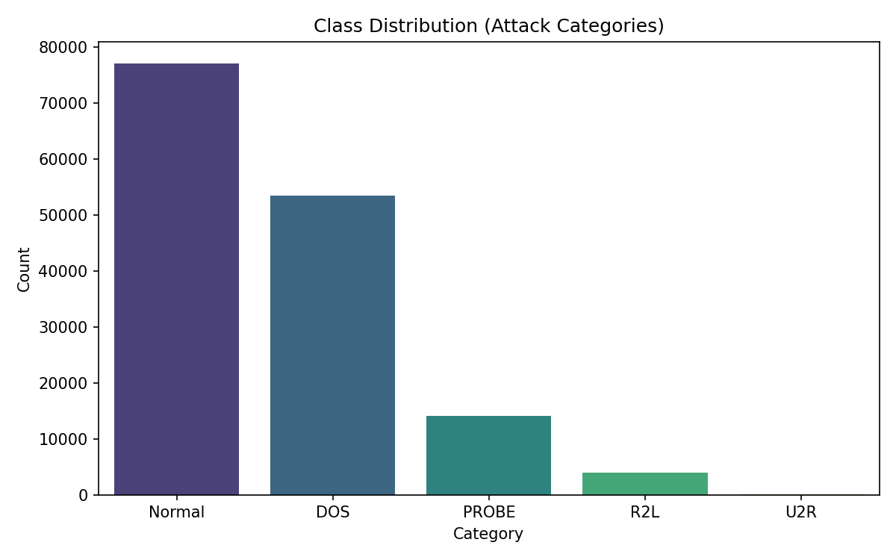

# Screenshots & Visual Asset Checklist

This document tracks visual assets, screenshot capture guides, and generated plots for the Network Intrusion Detection System.

---

## 1. Generated Exploratory & Training Visuals

### Class Distribution Plot (`results/class_distribution.png`)
Generated by `eda.py` during exploratory data analysis, showing class frequencies across NSL-KDD Train and Test datasets:



---

## 2. Web UI Screenshot Capture Checklist

To capture high-resolution screenshots for your portfolio or academic presentation:

- [ ] **01_Dashboard_Upload_Screen.png**:
  - **URL**: `http://127.0.0.1:5000/`
  - **Description**: Initial homepage with Tailwind CSS styling, file upload dropzone, and system architecture summary.
  
- [ ] **02_Prediction_Results_Summary.png**:
  - **URL**: `http://127.0.0.1:5000/` (after uploading `sample_upload.csv`)
  - **Description**: Summary metrics cards showing total rows, Normal traffic percentage, and detected threat counts.

- [ ] **03_Chartjs_Visualization.png**:
  - **URL**: `http://127.0.0.1:5000/`
  - **Description**: Dynamic Chart.js doughnut / bar chart illustrating the attack category breakdown.

- [ ] **04_Row_Level_Predictions_Table.png**:
  - **URL**: `http://127.0.0.1:5000/`
  - **Description**: Scrollable data table displaying row index, predicted threat category, and color-coded risk tags.

- [ ] **05_Health_API_Response.png**:
  - **URL**: `http://127.0.0.1:5000/health`
  - **Description**: JSON status response `{"status": "ok"}` in browser or Postman.

---

## 3. Recommended Storage Location

Place captured screenshot PNG files inside a `docs/screenshots/` directory:
```
docs/screenshots/
├── 01_Dashboard_Upload_Screen.png
├── 02_Prediction_Results_Summary.png
├── 03_Chartjs_Visualization.png
├── 04_Row_Level_Predictions_Table.png
└── 05_Health_API_Response.png
```
